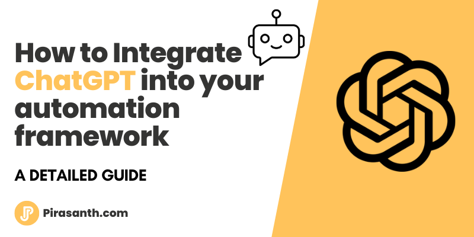

 <p align="center">
   
 </p>
 
 # ChatGPT
 
 This is example used on articial [How to Integrate ChatGPT into your automation framework](https://pirasanth.com/blog/how-to-integrate-chatgpt-into-your-automation-framework)
 
As we all know how powerful ChatGPT we can utiles its ability to intergrate it to our automation framework to help us generate some test scripts. 
In this example I will be using Cypress however this can be intergated to most automation framework in may different stack.

## Prerequisites:

- Go to [openai](https://platform.openai.com/account/api-keys) to generate your API Token - Free to sign up
- Node

## Install

1. clone project `git clone git@github.com:pirasanthan-jesugeevegan/cypress-demo-examples.git`
2. navigate to example -> chat-gpt
3. install deplency `npm install` inside chat-gpt directory
4. Rename `.env.example` -> `.env` and add the API token to the file

## Run

- Run ChatGPT script

```
npm run generate-script
```

- Run Cypress:

```
npm run cypress:open
```
